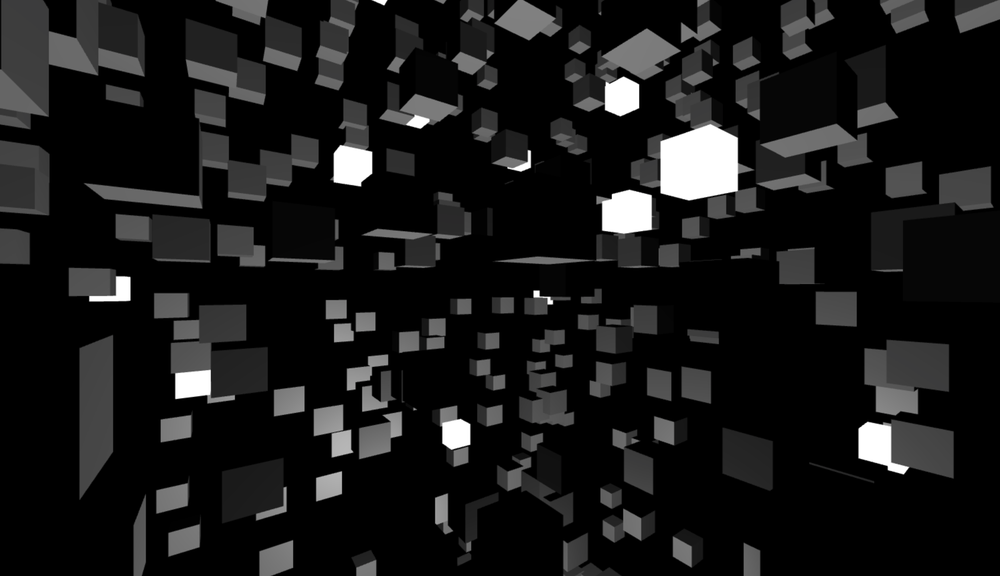

# WebGL Cubes



## Description

This project showcases the rendering of 3D cubes using WebGL technology. It utilizes the power of hardware acceleration to achieve real-time rendering. 

## Installation

To run this project locally, follow these steps:

1. Clone this repository.
```git clone https://github.com/your-username/webgl-cubes.git```
2. Navigate to the project directory.
```cd webgl-cubes```
3. Open the `index.html` file in a web browser that supports WebGL.

## Alternative Installation

Option 1: You can simply double-click on the index.html file and it will open in your default web browser.
Option 2: Alternatively, you can copy the contents of index.html and paste it into a new HTML file in a desired location on your computer. Then, open that HTML file in a web browser.

## Usage

Once you have the project running, you can perform the following actions:

- Watch cubes rotation. Thats it :)

Feel free to experiment with different cube configurations and explore the capabilities of WebGL rendering.

## Contributing

Contributions are welcome! If you find any issues or want to add new features, please submit a pull request. 

## License

This project is licensed under the [MIT License](LICENSE).

---

Enjoy exploring WebGL Cubes! If you have any questions or need further assistance, please don't hesitate to contact us.